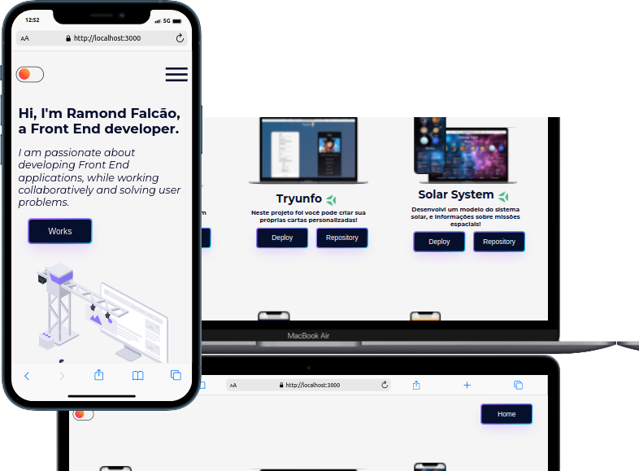
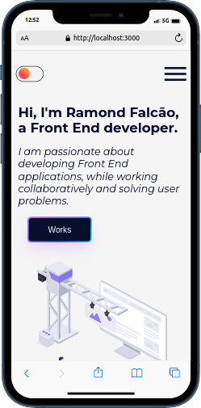
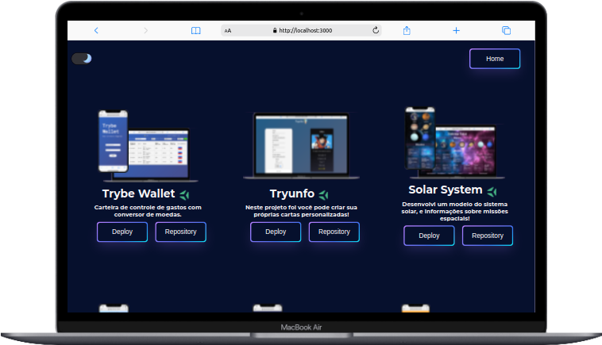

#  <h1 align="center">Projeto Solar System em React!</h1>

# Seja bem-vindo ao meu portfolio!

## O que foi desenvolvido

Desenvolvi um portfolio em React para exibir meus projetos durante o bloco de Front-end e o bloco de Fundamentos na Trybe!

## 🛠 Tecnologias

As seguintes ferramentas foram usadas na construção do projeto:

- [Css](https://developer.mozilla.org/en-US/docs/Web/CSS)
- [Html](https://developer.mozilla.org/en-US/docs/Web/HTML)
- [Figma]()
- [Javascript](https://developer.mozilla.org/en-US/docs/Web/JavaScript)
- [ReactJs](https://pt-br.reactjs.org/)
- [ReactRouter](https://reactrouter.com/docs/en/v6)
- [ContextApi](https://reactjs.org/docs/context.html)

## Mobile First 

Mobile First é um conceito aplicado em projetos web onde o foco inicial da arquitetura e 

desenvolvimento é direcionado aos dispositivos móveis.

## Dark Mode 

## Implementações futuras 

- Botão Translate
- Tecnologias Back-End

## Instruções para abrir a aplicação

[Link Da Aplicação](https://ramondfalcao.github.io/portifolio/)

1. Clone o repositório
  * `git@github.com:ramondfalcao/portifolio.git`
  * Entre na pasta do repositório que você acabou de clonar:
    * `cd portifolio`

2. Instale as dependências e inicialize o projeto
  * Instale as dependências:
    * `npm install`
  * Inicialize o projeto:
    * `npm start` (uma nova página deve abrir no seu navegador)
---
